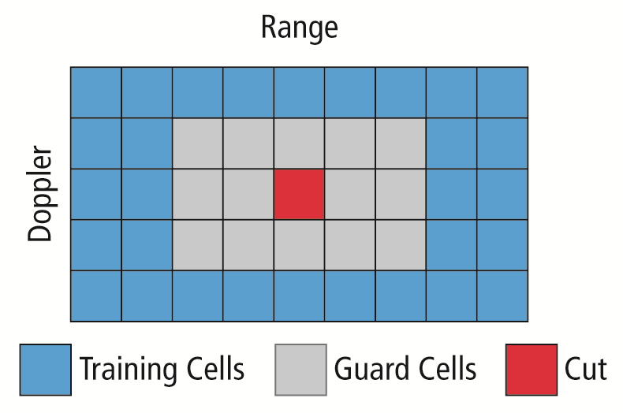
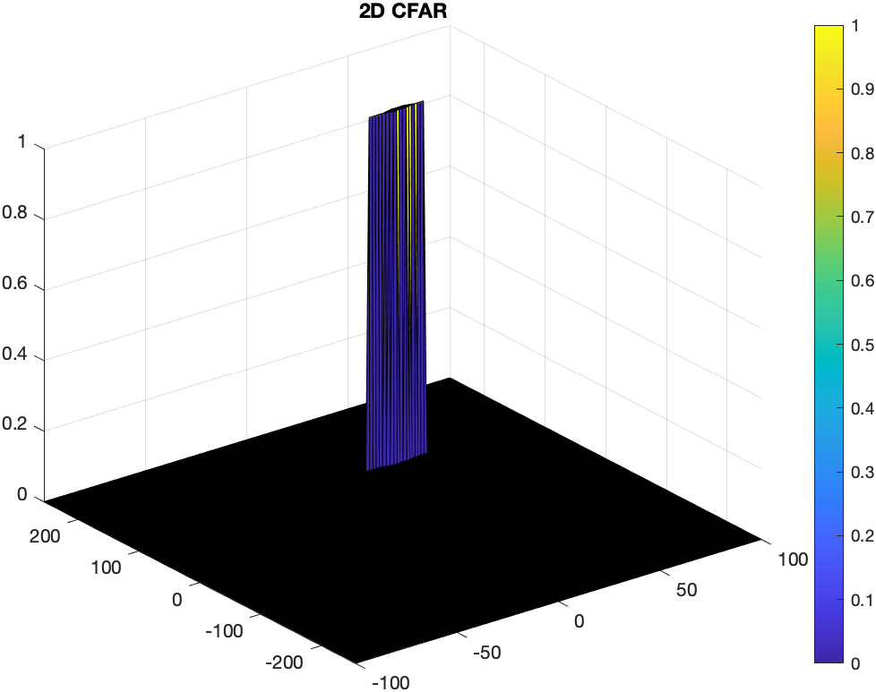

# Radar-Target-Generation-and-Detection

The following picture shows the projects general setup.


System requirements


## FMCW Waveform Design

>Using the given system requirements, design
a FMCW waveform. Find its Bandwidth (B), chirp time (Tchirp) and slope of the chirp.

The following graphic shows the desired waveform which will be designed in the project. The red signal is the transmitted signal, and the blue one is the received signal, which is delayed in time by . The chirp time is given by  and will be called  in the following. The Bandwidth one chirp ranges over, is given  whereas  indicates the frequency shift of the received signal.


[Image source: emagtech.com](http://www.emagtech.com/wiki/index.php/File:SysTUT7_5.png)

The bandwith, chrip time and slope getting calculated according to the following formula:

<!-- $$Bandwith (B) = \frac{speed\:of\:light}{2\:* \:range\:resolution}$$ -->
%20%3D%20%5Cfrac%7Bspeed%5C%3Aof%5C%3Alight%7D%7B2%5C%3A*%5C%3Arange%5C%3Aresolution%7D)

<!-- $$T_{Chirp} = \frac{Chirp\:factor\:* \:2\:* \:max\:range}{speed\:of\:light}$$ -->


<!-- $$slope = \frac{Bandwith}{T_{Chirp}}$$ -->


for the given system setup the values calculate as following:

<!-- $$B = \frac{c}{2\:* \:R_{res}} = \frac{3e^8\frac{m}{s}}{2\:* \:1m} = 150MHz$$ -->


<!-- $$T_{Chirp} = \frac{cf\:* \:2\:* \:R_{max}}{c} = \frac{5.5\:* \:2\:* \:200m}{3e^8\frac{m}{s}} = 7.3333e^{-6}s$$ -->


<!-- $$slope = \frac{B}{T_{Chirp}} = \frac{150MHz}{7.3333e^{-6}s} = 2.0455e^{13}$$ -->


>For given system requirements the calculated slope should be around 2e13


```
%chirp factor cf
cf = 5.5;

B = c / (2*Rres);

Tchirp = cf*2*Rmax/c;

slope = B/Tchirp;
```


## Simulation Loop / Signal Generation

>Simulate Target movement and calculate the beat or mixed signal for every timestamp.

The transmit signal  and the receive signal  are defined by the following formula where  is the delay in time.

<!-- $$T_x = cos(2\pi(f_ct+\frac{\alpha t^2}{2}))$$ -->
))


<!--R_x = cos(2\pi(f_c(t-\tau)+\frac{\alpha (t-\tau)^2}{2}))-->
%2B%5Cfrac%7B%5Calpha%20(t-%5Ctau)%5E2%7D%7B2%7D)))

<!--T_x * R_x = cos(2\pi(\frac{2\alpha R}{c}t+\frac{2f_cvn}{c}t))$$)-->
))

>A beat signal should be generated such that once range FFT implemented, it gives the correct range i.e the initial position of target assigned with an error margin of +/- 10 meters.

```
%For each time stamp update the Range of the Target for constant velocity.
%range of target gets de/increased by const velocity * time passed
r_t(i) = target_dist + target_vel * t(i);
%the time delay is given by the distance from ego vehicle to target and
%back and the signals speed
td(i) = 2 * r_t(i) / c;
```
```
%For each time sample we need update the transmitted and
%received signal.
Tx(i) = cos(2*pi*(fc*t(i) + slope * t(i)^2 / 2.0 ));
Rx(i) = cos(2*pi*(fc*(t(i)-td(i)) + slope * (t(i)-td(i))^2 / 2.0 ));
```
## Range FFT (1st FFT)

>Implement the Range FFT on the Beat or Mixed Signal and plot the result.
```
%reshape the vector into Nr*Nd array. Nr and Nd here would also define the size of
%Range and Doppler FFT respectively.
beat = reshape(Mix,Nr,Nd);
```
```
%run the FFT on the beat signal along the range bins dimension (Nr) and
%normalize.
fft_beat = fft(beat,Nr);
fft_beat = fft_beat/Nr;
```
```
% Take the absolute value of FFT output
fft_beat = abs(fft_beat);
```
```
% Output of FFT is double sided signal, but we are interested in only one side of the spectrum.
% Hence we throw out half of the samples.
fft_beat = fft_beat(1:Nr/2);
```
```
%plotting the range
figure ('Name','Range from First FFT')
subplot(2,1,1)
```
```
% plot FFT output
plot(fft_beat);
axis ([0 200 0 1]);
title('Range from First FFT')
```

>A correct implementation should generate a peak at the correct range, i.e the
initial position of target assigned with an error margin of +/- 10 meters.

The following graph shows the result, stating an object at around 120m distance, which has been specified earlier.


## Range Doppler Map

Code for the range doppler map has been rovided:

```
% The 2D FFT implementation is already provided here. This will run a 2DFFT
% on the mixed signal (beat signal) output and generate a range doppler
% map.You will implement CFAR on the generated RDM


% Range Doppler Map Generation.

% The output of the 2D FFT is an image that has reponse in the range and
% doppler FFT bins. So, it is important to convert the axis from bin sizes
% to range and doppler based on their Max values.

Mix=reshape(Mix,[Nr,Nd]);

% 2D FFT using the FFT size for both dimensions.
sig_fft2 = fft2(Mix,Nr,Nd);

% Taking just one side of signal from Range dimension.
sig_fft2 = sig_fft2(1:Nr/2,1:Nd);
sig_fft2 = fftshift (sig_fft2);
RDM = abs(sig_fft2);
RDM = 10*log10(RDM) ;

%use the surf function to plot the output of 2DFFT and to show axis in both
%dimensions
doppler_axis = linspace(-100,100,Nd);
range_axis = linspace(-200,200,Nr/2)*((Nr/2)/400);
figure,surf(doppler_axis,range_axis,RDM);
```

The image below shows the result for the defined target at 120m with a velocity of 35m/s.


## 2D CFAR

>Implement the 2D CFAR process on the output of 2D FFT operation, i.e the Range Doppler Map.

> The 2D CFAR processing should be able to suppress the noise and separate
the target signal. The output should match the image shared in walkthrough.

>Determine the number of Training cells for each dimension. Similarly, pick the number of guard cells.

The following image shows the general principal of choosing the training and guard cell geometry around the **C**ell **U**nder **T**est - **CUT**.


[Image source: electronicproducts.com](https://www.electronicproducts.com/Digital_ICs/Microprocessors_Microcontrollers_DSPs/Radar_signal_processing_fuels_automation_in_automotive_applications.aspx#)


Within this project the given setup has been chose:

```
%Select the number of Training Cells in both the dimensions.
T=[4,10];
%Select the number of Guard Cells in both dimensions around the Cell under
%test (CUT) for accurate estimation
G=[4,8];
```

>Slide the cell under test across the complete matrix. Make sure the CUT has margin for Training and Guard cells from the edges.

To slide across the matrix, two nested for loops have been use, where x and y are the coordinates in the matrix on the vertical and horizontal axis. They start and stop with an offset of the training and guard cells.

```
size = size(RDM);
rdm_size_x = size(1);
rdm_size_y = size(2);

for x = (T(1)+G(1)+1) : (rdm_size_x-(G(1)+T(1)))
   for y = (T(2)+G(2)+1) : (rdm_size_y-(G(2)+T(2)))
       % Use RDM[x,y] as the matrix from the output of 2D FFT for implementing CFAR
```

>For every iteration sum the signal level within all the training cells. To sum convert the value from logarithmic to linear using db2pow function.

First the overall training cell region gets been summed up, then the sum of the guard cell region gets been subtracted to stay with only the training cells.

```
noise_sum = sum(db2pow(RDM( i-T(1)-G(1) : i+T(1)+G(1), j-G(2)-T(2) : j+G(2)+T(2) )),'all') -...
            sum(db2pow(RDM(i-G(1) : i+G(1), j-G(2) : j+G(2) )),'all');
```

>Average the summed values for all of the training cells used. After averaging convert it back to logarithmic using pow2db.

To count the training cells a similar approach has been chosen. First overall cells for x and y direction get counted and multiplied to end up with the overall amount of cells. Then same has been done with only the guard cells, which finally will be subtracted from the overall amount.

```
num_Tcells = (2*( T(1)+G(1) ) +1) * (2*( T(2)+G(2) ) +1) ...
                    - (2* G(1) +1) * (2* G(2) +1);

       threshold = pow2db(noise_sum / num_Tcells);
```

>Further add the offset to it to determine the threshold.

```
threshold_cfar(i,j) = threshold;
```

 >Next, compare the signal under CUT against this threshold.
If the CUT level > threshold assign it a value of 1, else equate it to 0.

Finally the value for the CUT will be set to one if the threshold is been exceeded. All other cells will be left with the initial value zero.

```
if (CUT > threshold)
     signal_cfar(i,j) = 1;
end
%signal_cfar is initialized with zeros.
```

The result can be observed int the following image:




>Create a CFAR README File

> Implementation steps for the 2D CFAR process.
Selection of Training, Guard cells and offset.
Steps taken to suppress the non-thresholded cells at the edges.
