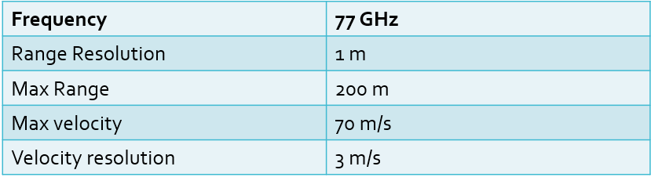
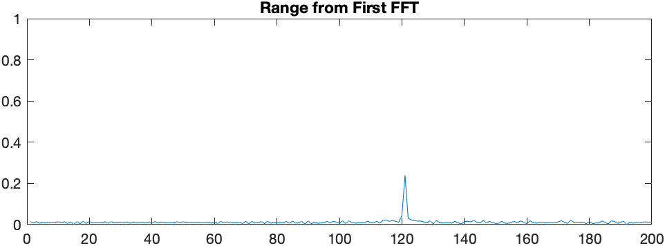
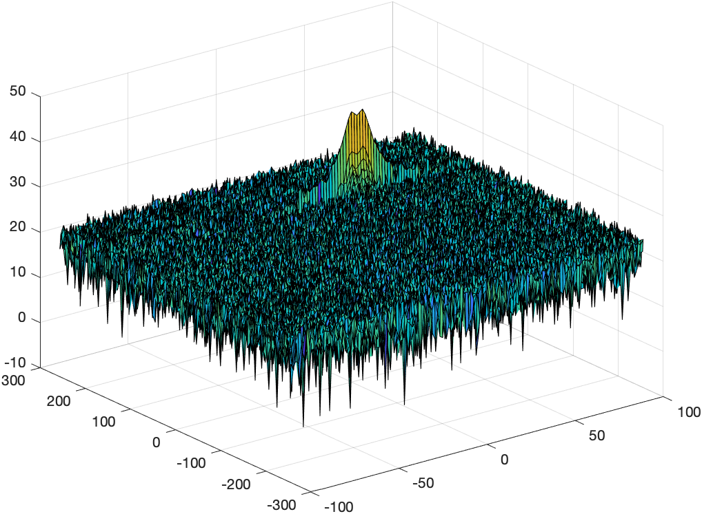

# Radar-Target-Generation-and-Detection




## FMCW Waveform Design

>Using the given system requirements, design
a FMCW waveform. Find its Bandwidth (B), chirp time (Tchirp) and slope of the chirp.


[Image source: emagtech.com](http://www.emagtech.com/wiki/index.php/File:SysTUT7_5.png)

The bandwith, chrip time and slope getting calculated according to the following formula:

[comment]: <> ($$Bandwith (B) = \frac{speed\:of\:light}{2\:* \:range\:resolution}$$)
%20%3D%20%5Cfrac%7Bspeed%5C%3Aof%5C%3Alight%7D%7B2%5C%3A*%5C%3Arange%5C%3Aresolution%7D)

[comment]: <> ($$T_{Chirp} = \frac{Chirp\:factor\:* \:2\:* \:max\:range}{speed\:of\:light}$$)


[comment]: <> ($$slope = \frac{Bandwith}{T_{Chirp}}$$)


for the given system setup the values calculate as following:

[comment]: <> ($$B = \frac{c}{2\:* \:R_{res}} = \frac{3e^8\frac{m}{s}}{2\:* \:1m} = 150MHz$$)


[comment]: <> ($$T_{Chirp} = \frac{cf\:* \:2\:* \:R_{max}}{c} = \frac{5.5\:* \:2\:* \:200m}{3e^8\frac{m}{s}} = 7.3333e^{-6}s$$)


[comment]: <> ($$slope = \frac{B}{T_{Chirp}} = \frac{150MHz}{7.3333e^{-6}s} = 2.0455e^{13}$$)


>For given system requirements the calculated slope should be around 2e13


```
%chirp factor cf
cf = 5.5;

B = c / (2*Rres);

Tchirp = cf*2*Rmax/c;

slope = B/Tchirp;
```


## Simulation Loop / Signal Generation

>Simulate Target movement and calculate the beat or mixed signal for every timestamp.


[comment]: <> ($$T_x = cos(2\pi(f_ct+\frac{\alpha t^2}{2}))$$)

))


[comment]: <> ($$R_x = cos(2\pi(f_c(t-\tau)+\frac{\alpha (t-\tau)^2}{2}))$$)

%2B%5Cfrac%7B%5Calpha%20(t-%5Ctau)%5E2%7D%7B2%7D)))

[comment]: <> ($$T_x * R_x = cos(2\pi(\frac{2\alpha R}{c}t+\frac{2f_cvn}{c}t))$$)

))

>A beat signal should be generated such that once range FFT implemented, it gives the correct range i.e the initial position of target assigned with an error margin of +/- 10 meters.
```
% *%TODO* :
%For each time stamp update the Range of the Target for constant velocity.
%range of target gets de/increased by const velocity * time passed
r_t(i) = target_dist + target_vel * t(i);
%the time delay is given by the distance from ego vehicle to target and
%back and the signals speed
td(i) = 2 * r_t(i) / c;
```
```
% *%TODO* :
%For each time sample we need update the transmitted and
%received signal.
Tx(i) = cos(2*pi*(fc*t(i) + slope * t(i)^2 / 2.0 ));
Rx(i) = cos(2*pi*(fc*(t(i)-td(i)) + slope * (t(i)-td(i))^2 / 2.0 ));
```
## Range FFT (1st FFT)

>Implement the Range FFT on the Beat or Mixed Signal and plot the result.
```
% *%TODO* :
%reshape the vector into Nr*Nd array. Nr and Nd here would also define the size of
%Range and Doppler FFT respectively.
beat = reshape(Mix,Nr,Nd);
```
```
% *%TODO* :
%run the FFT on the beat signal along the range bins dimension (Nr) and
%normalize.
fft_beat = fft(beat,Nr);
fft_beat = fft_beat/Nr;
```
```
% *%TODO* :
% Take the absolute value of FFT output
fft_beat = abs(fft_beat);
```
```
% *%TODO* :
% Output of FFT is double sided signal, but we are interested in only one side of the spectrum.
% Hence we throw out half of the samples.
fft_beat = fft_beat(1:Nr/2);
```
```
%plotting the range
figure ('Name','Range from First FFT')
subplot(2,1,1)
```
```
% *%TODO* :
% plot FFT output
plot(fft_beat);
axis ([0 200 0 1]);
title('Range from First FFT')
```

>A correct implementation should generate a peak at the correct range, i.e the
initial position of target assigned with an error margin of +/- 10 meters.

The following graph shows the result, stating an object at around 120m distance, which have been specified earlier.



## Range Doppler Map

Code for the range doppler map has been rovided:

```
% The 2D FFT implementation is already provided here. This will run a 2DFFT
% on the mixed signal (beat signal) output and generate a range doppler
% map.You will implement CFAR on the generated RDM


% Range Doppler Map Generation.

% The output of the 2D FFT is an image that has reponse in the range and
% doppler FFT bins. So, it is important to convert the axis from bin sizes
% to range and doppler based on their Max values.

Mix=reshape(Mix,[Nr,Nd]);

% 2D FFT using the FFT size for both dimensions.
sig_fft2 = fft2(Mix,Nr,Nd);

% Taking just one side of signal from Range dimension.
sig_fft2 = sig_fft2(1:Nr/2,1:Nd);
sig_fft2 = fftshift (sig_fft2);
RDM = abs(sig_fft2);
RDM = 10*log10(RDM) ;

%use the surf function to plot the output of 2DFFT and to show axis in both
%dimensions
doppler_axis = linspace(-100,100,Nd);
range_axis = linspace(-200,200,Nr/2)*((Nr/2)/400);
figure,surf(doppler_axis,range_axis,RDM);
```



## 2D CFAR

>Implement the 2D CFAR process on the output of 2D FFT operation, i.e the Range Doppler Map.

> The 2D CFAR processing should be able to suppress the noise and separate
the target signal. The output should match the image shared in walkthrough.


>Create a CFAR README File

> Implementation steps for the 2D CFAR process.
Selection of Training, Guard cells and offset.
Steps taken to suppress the non-thresholded cells at the edges.
